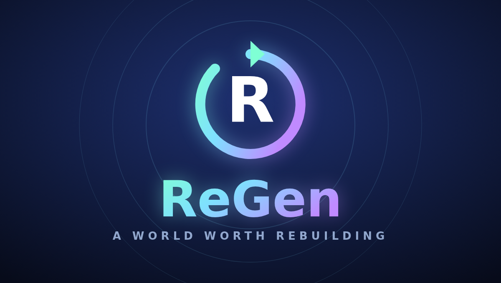

# ReGen

A single-player 2D action-adventure. Four broken worlds to explore, procedural
rifts to raid, four arcade cabinets to beat and 48 skins to collect — the same
game on Windows, Android and the web, from one codebase.



## What it is

You are a Regen, and the world is fading. Aetherhold is the last town standing;
four gates lead out of it into Verdant Hollow, the Ember Wastes, Frostbite Reach
and the Void Sanctum. Each world is seeded and procedurally generated, dotted
with shrines, caches, enemy camps, three dungeon entrances and a guardian that
has to fall before the next gate opens.

- **Explore** four biomes with their own terrain rules, weather, creatures,
  soundtrack and lighting, plus a hub town with a store, a skin vault, a quest
  board, an upgrade forge and an arcade.
- **Raid** three-floor procedural dungeons: rooms and corridors, a warded chest
  that holds the key to the sealed stair, and a Guardian at the bottom. Clear one
  without taking a hit and something rare unlocks.
- **Fight** thirty enemy types across six AI behaviours and five bosses with
  phase changes and telegraphed patterns. Eight weapon classes, each with its own
  attack rhythm and special ability.
- **Collect** 48 skins across five rarities. Every one changes how you look, what
  you fight with and how you play — a Cinderlord hits for 22% more and dies
  faster; a Chronarch dashes almost on cooldown. Three mythics can only be earned.
- **Play** four mini-games: Pulse Runner, Essence Match, Sky Angler and the
  Blight Arena.
- **Spend** coins and gems in the store on supplies, caches and permanent stat
  cores.

Progress, settings and your wardrobe are saved locally and survive between
sessions. There is no server, no account and no network access of any kind.

## Downloads

| Platform | File | Notes |
| --- | --- | --- |
| Windows 10/11 (x64) | `ReGen Setup.exe` | Installs per-user, no admin needed. Puts a ReGen shortcut on the Desktop, in the Start Menu and in your Downloads folder. |
| Android 5.0+ (API 21) | `ReGen.apk` | Sideload it: allow "install unknown apps" for your browser or file manager, then open the file. |

Both are unsigned by a commercial certificate, so Windows SmartScreen and
Android's installer will both warn you the first time. On Windows choose **More
info → Run anyway**; on Android confirm the install-unknown-apps prompt.

## Controls

| | Keyboard & mouse | Gamepad | Touch |
| --- | --- | --- | --- |
| Move | `WASD` / arrows | left stick | drag the left half of the screen |
| Aim | mouse | right stick | drag the right half of the screen |
| Attack | left mouse / `J` | right trigger | right-hand drag, or the sword button |
| Dash | `Space` / `Shift` | `A` | boot button |
| Ability | `Q` / `F` / right mouse | `Y` | bolt button |
| Interact | `E` | `X` | key button |
| Map / Inventory / Pause | `M` · `I` · `Esc` | select · start | HUD buttons |

On a touch screen the right-hand drag both aims and fires, and the game
auto-targets the nearest enemy when you are not aiming. Orientation is locked to
landscape so the playfield is identical on every device.

## How it is built

The game is plain ES5 JavaScript on a Canvas 2D surface — no engine, no
framework, no build step for the game itself. **There are no image or audio files
anywhere in the project.** Every tile, creature, prop, icon and note is generated
at runtime:

- `game/src/04-art.js` and `05-art-entities.js` paint tiles, creatures, props and
  UI icons into offscreen canvases from a handful of palette and shape
  parameters, then blit them.
- `game/src/02-audio.js` is a small synthesiser and a generative sequencer: each
  world has a key, a tempo and a chord progression, and the arrangement thickens
  as combat heats up.

That keeps the whole game under 500 KB and means there is no such thing as a
missing-asset bug.

### Performance

The simulation runs on a fixed 60 Hz timestep with an accumulator, so cooldowns,
physics and AI behave identically on a 60 Hz phone and a 165 Hz monitor. The
renderer keeps its per-frame cost low by construction:

- terrain is baked into 16×16-tile chunk bitmaps and blitted a handful at a time;
- every sprite is trimmed to its non-transparent bounds before it is drawn;
- lighting is a darkness mask with feathered holes rather than a full-screen
  multiply blend;
- particles, projectiles, pickups and floating text all live in fixed-size pools,
  so nothing is allocated during play;
- render scale adapts downward automatically if a device cannot hold the frame
  budget, and climbs back when it can.

The smoke test asserts the game's own work stays under 8 ms per frame with 45+
enemies on screen; it currently measures 2.4–6.3 ms across four device profiles.

## Building it yourself

Requires Node 20+, a JDK, Python 3, ImageMagick, NSIS, and (on Linux or macOS,
to stamp the Windows exe icon) wine.

```bash
npm install
npm run build          # brand assets, tests, ReGen Setup.exe and ReGen.apk
```

Or one target at a time:

```bash
npm run logo           # render the icon set from brand/logo.html
npm test               # drive the real game in Chromium across 4 device profiles
npm start              # run the desktop build locally
npm run dist:win       # dist/ReGen Setup.exe
npm run apk            # dist/ReGen.apk
```

### The Android build

There is no Android SDK in this project. `tools/build-apk.mjs` assembles the APK
from parts that are all on Maven Central:

- `org.robolectric:android-all` — the `android.jar` to compile against
- `com.jakewharton.android.repackaged:dalvik-dx` — the dexer
- `com.android.tools.build:apksig` — Google's own signer, v1 + v2

The binary `AndroidManifest.xml`, the `resources.arsc` table and the
alignment-aware zip are produced by the encoders in `android/tools/`. Every
framework resource ID they use is checked against the real `android.R` in the
`android.jar`, and the finished package is verified twice: once by
`android/tools/verify.py`, which decodes the manifest and the resource table
back, and once by an unrelated third-party parser, so a mistake shared between
the encoder and its own decoder cannot slip through.

The signing key is generated on first build into `build/android/regen-release.p12`
and is deliberately not committed. Keep that file if you want later builds to
install as updates over an earlier one; lose it and Android will treat the next
build as a different app.

### The Windows build

`electron-builder` packages the app directory and `build/regen-installer.nsi` is
compiled by NSIS into `ReGen Setup.exe` — a per-user installer that needs no
administrator rights, resolves the real Downloads folder from the shell's
known-folder registry entry, and registers a proper uninstaller.

## Layout

```
game/            the game — runs as-is in any browser, open game/index.html
  src/           engine, worlds, entities, UI, mini-games (load order by prefix)
electron/        the desktop shell
android/         the WebView activity and the APK encoders
brand/           logo source and the generated icon set
build/           installer script and build resources
tools/           build and test scripts
```

## Licence

MIT — see [LICENSE](LICENSE).
